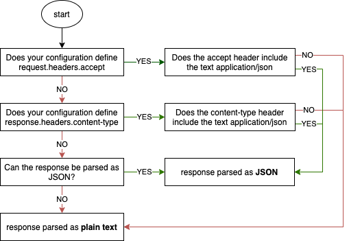

<a href="#readme"></a>

# NCDC


[](https://badge.fury.io/js/ncdc)
[](https://codecov.io/gh/tamj0rd2/ncdc)
[](http://commitizen.github.io/cz-cli/)
[](https://dependabot.com)

NCDC (or node cdc) is a tool that takes a consumer contract (written in yaml)
and tests the specified endpoints against a producer. You can also run a single
command to mock those endpoints.

The point of using this tool is to ensure that each endpoint you use in
development is called in the same way and responds in the same way as the
endpoints in your live environment. There's not much point in testing against
mock APIs that don't strongly resemble your live APIs.

This tool can easily integrate with typescript to prevent you from having to
write JSON schemas for your already defined Typescript interfaces, types and
enums. With this, you're guaranteed that your code, mock API endpoints and
real endpoints are all consistent with eachother.

## Contents

- [Getting Started](#getting-started)
  - [Installation](#installation)
  - [Example config](#example-config.yml)
  - [Serving mocks](#serving-mocks-using-the-config-file)
  - [Running tests](#testing-real-endpoints-against-the-config)
  - [Generating JSON schemas](#generating-json-schemas)
- [CLI Usage](#cli-usage)
  - [Serve mode](#serve)
    - [Local development recipes](#local-development-recipes)
  - [Test mode](#test)
- [Response content negotiation](#response-content-negotiation)
- [Docker use case](#docker-use-case)

## Getting started

### Installation

`npm install ncdc --save-dev` or `yarn add ncdc -D`

### Example config.yml

The below `config.yml` file contains 2 configurations

```yaml
- name: Book not found
  serveOnly: true
  request:
    method: GET
    endpoints: /api/books/a-bad-id
  response:
    code: 404

- name: Book
  request:
    method: GET
    endpoints:
      - /api/books/123
      - /api/books/456
    serveEndpoint: /api/books/*
  response:
    code: 200
    headers:
      content-type: application/json
    type: Book
    serveBody:
      {
        ISBN: "9780141187761",
        ISBN_13: 978-0141187761,
        author: George Orwell,
        title: 1984 Nineteen Eighty-Four,
        inventoryId: item-87623
      }
```

config.yml references the type `Book` which is exported from `mySourceFile.ts`:

```typescript
export interface Book {
  ISBN: string
  ISBN_13: string
  author: string
  title: string
  // You can set extra json schema properties via JSDoc comments
  /** @pattern ^item- */
  inventoryId: string
}
```

====> **You can find more information about writing your config file
[HERE](./docs/CONFIG.md#config), as well how all of the options behave** <====

### Serving mocks using the config file

`npx ncdc serve ./config.yml 3000`

This will serve each configuration on `http://localhost:3000`.

When GET requests are sent to `/api/books/a-bad-id`, ncdc will respond with a
404 status code.

When GET requests are sent to `/api/books/123` or `/api/books/456`, ncdc will
respond with the following:

- Status code as 200
- content-type header as application/json
- a JSON body with the value of `serveBody`

You can find more information about serve mode [here](#serve)

### Testing real endpoints against the config

`npx ncdc test ./config.yml https://example.com`

This will run tests for each configuration except those with `serveOnly` set to
true. For this reason, the `Book not found` configuration will not be tested
against the real API.

For the `Book` configuration, ncdc will make GET requests to
https://example.com/api/books/123 and https://example.com/api/books/456 and
verify that both responses meet these requirements:

- It responds with a 200 status code
- It responds with the content-type header set to application/json
- The response body is JSON containing at least:
  - property `ISBN` with a string value
  - property `ISBN_13` with a string value
  - property `author` with a string value
  - property `title` with a string value
  - property `inventoryId` with a string value starting with `item-`

You can find more information about test mode [here](#test)

### Generating JSON schemas

`npx ncdc generate ./config.yml --output ./schemas`

This will write JSON schemas to disk for each of the types you reference in your
config.yml, such as `Book` in the above example. This can be useful for caching
purposes.

You can find more information about generating schemas and why you might want to
do that [here](#generate)

## CLI usage

```
$ npx ncdc --help
ncdc <command>

Commands:
  ncdc generate <configPath>        Generates a json schema for each type
                                    specified in the config file
  ncdc serve <configPath> [port]    Serves configured endpoints
  ncdc test <configPath> <baseURL>  Tests configured endpoints

Options:
  --version  Show version number                                       [boolean]
  --help     Show help                                                 [boolean]

Examples:
  ncdc generate ./config.yml                Generates json schemas for any type
                                            specified in config.yml.
  ncdc serve ./config.yml 4000              Serves the mock API endpoints
                                            defined in config.yml on port 4000.
  ncdc test ./config.yml                    Tests that the responses for the API
  https://example.com                       endpoints defined in config.yml
                                            match the configured parameters.
```

You can use the `-f` or `--force` flag to skip typechecking your source files.
This speeds up the generate command, however, you should still use another tool
e.g `tsc` to typecheck your project. If you try to use broken types with ncdc,
ncdc will probably behave unexpectedly.

### Serve

Serves mock API endpoints defined in config.yml

#### CLI Usage

Run `npx ncdc serve --help` to get contextual usage information and examples for
this command.

#### How it works

When ncdc receives a request, it will go through each configuration in your
config.yml (from top to bottom) and serve the first one that meets all of your
request constraints. If the request does not match any of your configurations,
ncdc will response with a 404.

#### Local development recipes

How to run your fake APIs locally:

`package.json`

```jsonc
  "scripts": {
    // dev script before adding ncdc
    "dev": "nodemon --watch 'src/**/*.ts' --exec 'ts-node' src/index.ts",
    // scripts after adding ncdc
    "devServer": "nodemon --watch 'src/**/*.ts' --exec 'ts-node' src/index.ts",
    "bookService": "ncdc serve ./book-service.yml 4000",
    "filmService": "ncdc serve ./film-service.yml 4001",
    // concurrently is optional, you could just run each npm script in separate shells
    "dev": "concurrently --kill-others-on-fail 'npm:bookService' 'npm:filmService' 'npm:devServer'",
  }
```

### Test

Tests that responses from a real API match the configured parameters in config.yml

#### CLI Usage

Run `npx ncdc test --help` to get contextual usage information and examples for
this command.

## Response content negotiation


